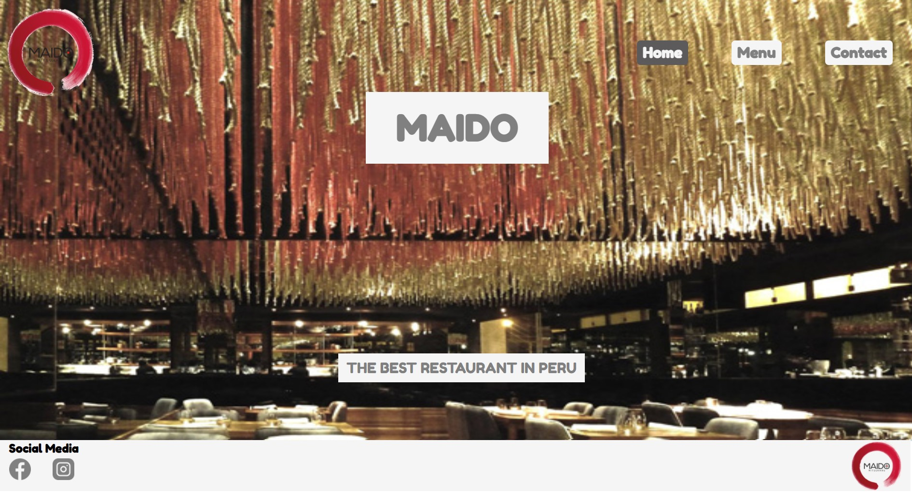

  

<h1 align="center">Maido</h1>

  <strong>Made by Jenny Cárdenas</strong>
   
   This is a retaurant page made all with jJavascript and allows you to navigate between tabs.

  
   ‎ ‎ ‎ ‎
  

## 👩🏼‍💻 About Maido

This a single restaurant page with all page information dynamically generated and tab-switching achieved using pure Javascript .

## 🔴 Live Demo:

[Live Demo Link](https://janis-jenny.github.io/Restaurant-Page/)

## 🔧 Built With

- HTML5
- CSS3
- JavaScript
- Webpack
- Linters
- VS Code

## 🤖 How it works

To get a local copy up and running follow these simple steps:

1. Go to the [repository page](https://github.com/janis-jenny/Restaurant-Page/).
2. Press the "Code" button and copy the link.
3. Clone it using git command `git clone <you_repository_link>`.
4. Move to the local project: cd `<Your_repository_name>`.
5. Run `npm install` to get all the dependencies.
6. Run `npm run build` for one time build of bundle after changes.
7. Run `npm run watch` to run webpack build in watch mode.

## 👥 Author

👤 **Jenny Cárdenas**

- GitHub: [@janis_jenny](https://github.com/janis-jenny)
- Twitter: [@janis_jenny](https://twitter.com/janis_jenny)
- LinkedIn: [Jenny Càrdenas](https://www.linkedin.com/in/paolajenny)

## 🤝 Contributing

Contributions, issues, and feature requests are welcome!

Feel free to check the [issues page](https://github.com/janis-jenny/Restaurant-Page/issues).

## ⭐ Show your support

Give a ⭐️ if you like this project!

## 📌 Acknowledgments

- [Stack Overflow](https://es.stackoverflow.com/)
- [Microverse](https://www.microverse.org/)
- [Odin Project](https://www.theodinproject.com/)
- Stand up team

## 📝 License

This project is [MIT](https://opensource.org/licenses/MIT) licensed.
